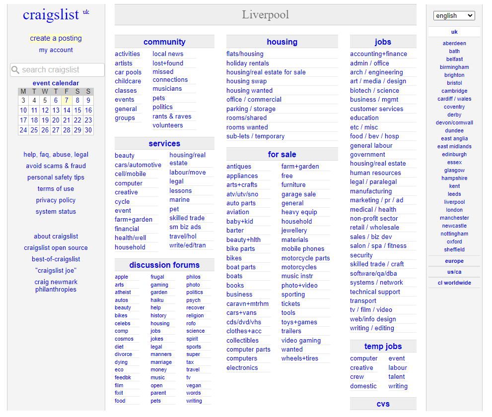
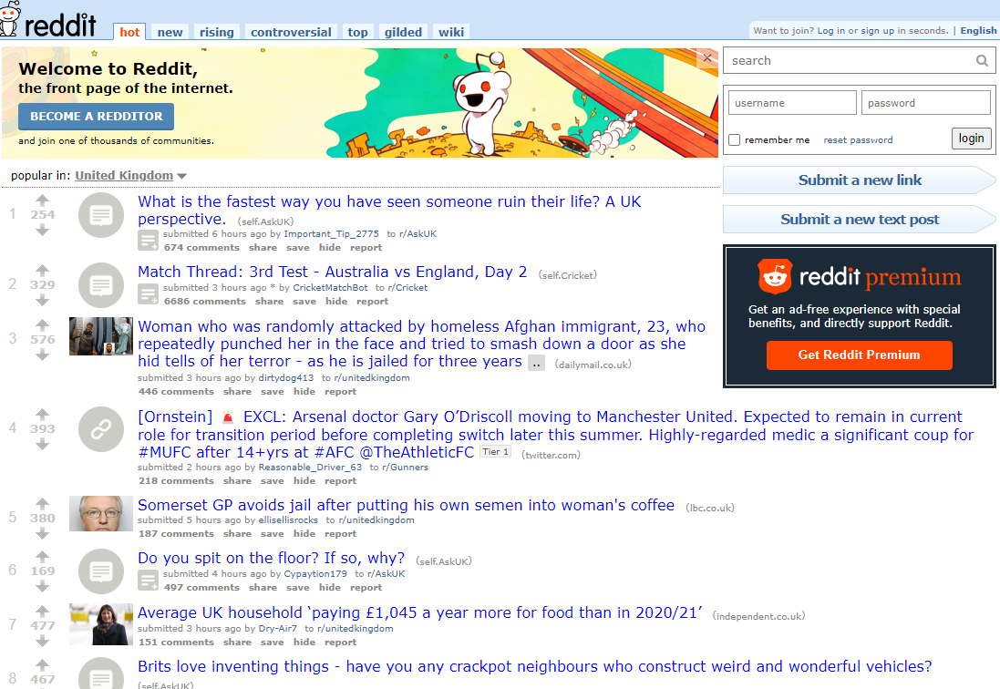
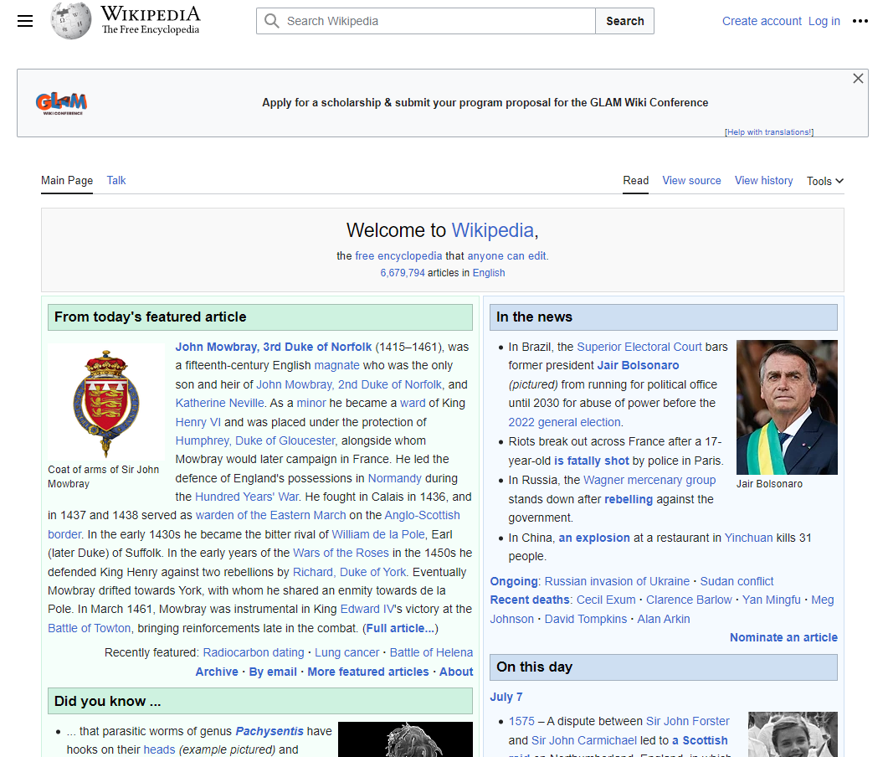

## What is Brutalist Web Design

Brutalist web design has two competing philosophies, one of functionality and the other, audacity. I tend to favor the more functional style of brutalism which focuses on making a website and it's content easy to read & navigate. It also focuses on keeping the natural functionality and responsivieness of HTML so that the amount of CSS you use to style a site is reduced. This form of web design has always stood out to me as modern web design is all about making things look good even if it means having to change the natural functionality/look of a HTML tag **e.g** making an anchor tag look like a button.

This might come across as boring to some people, particularly those who love CSS and design in general as it might seem to them that brutalist web design is very limiting in what you can create or as some might say, boring. I however, don't think that is the case as I believe that having rules like the ones brutalist web design introduces, when creating a web design, can produce work that stands out from the rest and can make your site more memorable as shown below.

#### Craigslist

#### Old Reddit

#### Wikipedia

## Principles of Brutalism

Brutalist web design has principles that anyone implementing should follow and they include:

- making content readable on all reasonable screens and devices.
- making sure only hyperlinks and buttons respond to clicks.
- making sure hyperlinks are underlined and buttons look like buttons.
- making sure the back button works as expected.
- making all content viewable by scrolling.
- making sure you add decoration when needed and no unrelated content.
- making performance a feature of your site.

These priciples where sourced from [here](https://brutalist-web.design/). The site goes into more detail concerning them so I recommend you have a read if this style of design interests you.
